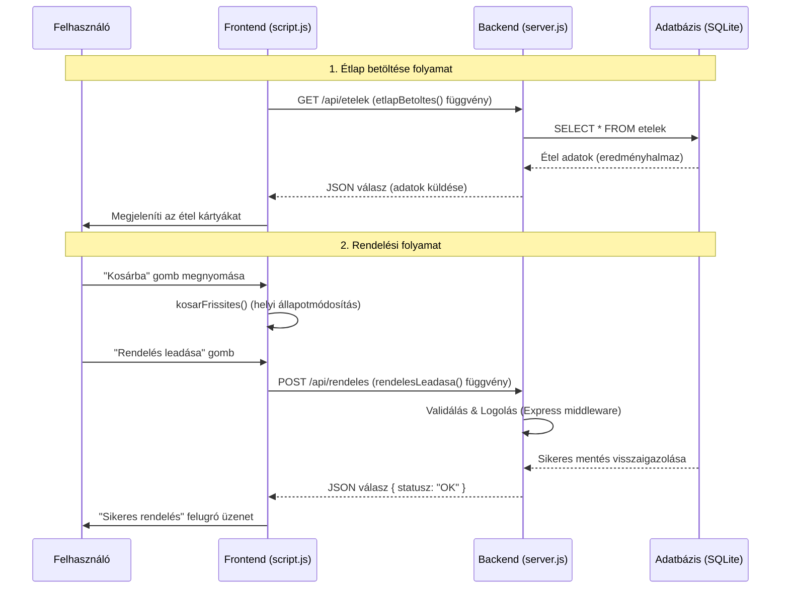

#  Étterem Rendelési Rendszer

Ez egy Full-Stack webalkalmazás, amely egy egyszerű éttermi rendelési folyamatot valósít meg. A projekt az egyetemi kurzus követelményei alapján készült.

##  Funkciók
*   **Dinamikus Étlap:** Az ételek egy SQLite relációs adatbázisból töltődnek be.
*   **Kosár Kezelés:** Termékek hozzáadása és végösszeg számítása kliensoldalon.
*   **Rendelés Leadása:** Az adatok továbbítása a szervernek API végponton keresztül.
*   **Reszponzív Design:** Bootstrap 5 keretrendszerrel készült, így mobilról is jól használható.
*   **Rendelés naplózása:** Minden sikeres rendelés mentésre kerül a rendelesek.log fileban.
*   **Docker támogatás:** Az alkalmazás konténerizálva is futtatható a mellékelt 'Dockerfile' segítségével.

##  Technológiai Stack
*   **Frontend:** HTML5, CSS3 (Bootstrap 5), JavaScript (Fetch API)
*   **Backend:** Node.js, Express.js
*   **Adatbázis:** SQLite3 (Relációs adatbázis)

##  API Végpontok
*   `GET /api/etelek` - Az összes választható étel listázása.
*   `POST /api/rendeles` - Új rendelés rögzítése és naplózása.
## Műkődés

##  Telepítés és Futtatás
1.  Klónozza vagy töltse le a projektet.
2.  Nyisson egy terminált a mappában.
3.  Telepítse a függőségeket:
    ```bash
    npm install
    ```
4.  Indítsd el a szervert:
    ```bash
    node server.js
    ```
5.  Nyisd meg a böngészőben: `http://localhost:3000`

##  Tesztelés
A unit tesztek futtatásához használja a következő parancsot:
```bash
node teszt.js
##  Docker futtatás
Ha rendelkezik Docker-rel, az alábbi parancsokkal is elindíthatja az alkalmazást:
1. `docker build -t etelrendelo .`
2. `docker run -p 3000:3000 etelrendelo`
